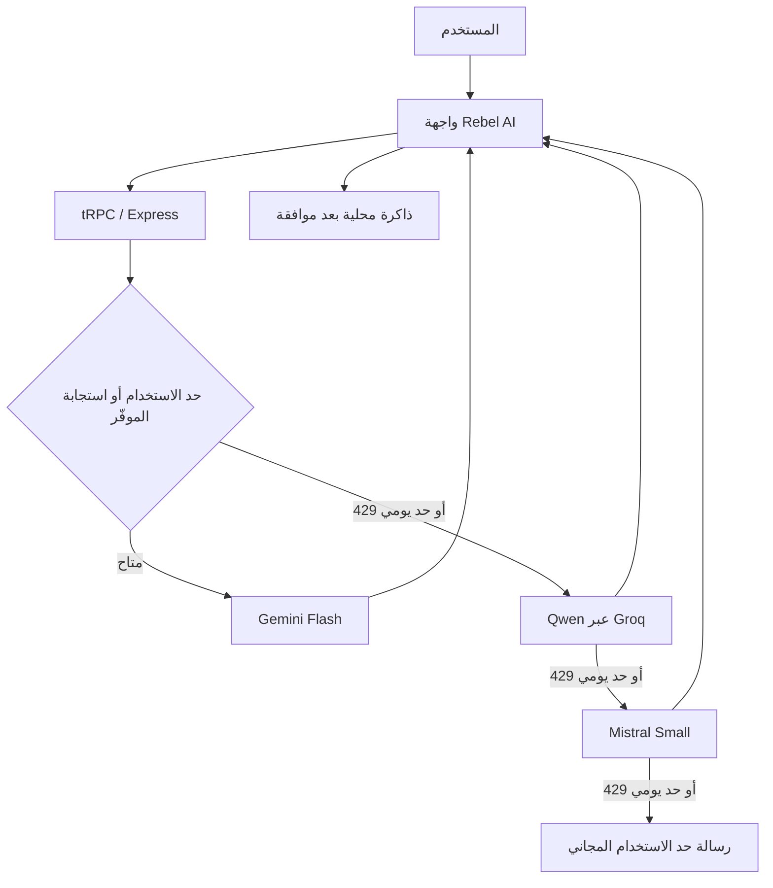

# Rebel AI — الملخص التقني وحالة التنفيذ

**الغرض من الوثيقة:** مشاركة صورة هندسية دقيقة عن التطبيق مع مراجع تقني، من دون تضمين كلمات مرور أو مفاتيح API أو بيانات مستخدمين.

## 1. تعريف المنتج

**Rebel AI** تطبيق جوال عربي باتجاه كتابة من اليمين إلى اليسار، صُمم ليكون مساعداً للمحادثة والتحليل وتنظيم الأفكار. يقدّم محادثة نصية وصوتية، ذاكرة محلية لا تُحفظ فيها اقتراحات التعلّم إلا بعد موافقة صريحة، مساعدين متخصصين، ومركزاً للمكونات الإضافية. لا يدّعي التطبيق معرفة يقينية من تفاصيل قليلة، ولا ينفذ إجراءات خارج المحادثة دون موافقة المستخدم.

> الهدف الحالي هو تسليم نسخة جاهزة للنشر والتوزيع، مع بقاء قرار نشرها في Google Play وApp Store بيد المالك.

## 2. البنية التقنية

| الطبقة | التقنية | الوضع الحالي |
|---|---|---|
| تطبيق الجوال | Expo SDK 54، React Native، TypeScript، Expo Router | منفّذ |
| التصميم | NativeWind ولوحة ألوان هادئة، واجهات عربية RTL | منفّذ |
| الواجهة الخلفية | Express وtRPC على الخادم | منفّذ |
| الحالة المحلية | React Context وAsyncStorage | منفّذ؛ يجري تحويلها لتكون معزولة لكل حساب |
| التخزين الآمن للجلسة | Expo SecureStore على الهاتف | مستخدم للجلسات المحلية؛ يجري تحديثه لجلسات المستخدمين |
| قاعدة البيانات | MySQL/TiDB عبر Drizzle ORM | منفّذ؛ أضيفت جداول الحسابات والحصص والمفاتيح الشخصية |

## 3. وظائف الواجهة المنفذة

| الوحدة | ما تنفذه |
|---|---|
| المحادثة | إرسال نص، عرض الرد، قراءة الرد بصوت، عرض النموذج الذي أجاب فعلياً، وإظهار الحالات والأخطاء. |
| Rebal Live | جولة صوتية: تسجيل → تحويل الصوت إلى نص → رد النموذج → قراءة الرد صوتياً. ليست بثاً صوتياً لحظياً كاملاً بعد. |
| الذاكرة | بحث وحذف وعرض عناصر محلية، مع حدود واضحة للمصدر ونوع المعلومة. |
| الموافقات | لا يُضاف تعلم مقترح أو إجراء مقترح إلى الذاكرة قبل اختيار المستخدم. |
| Rebel GPTs | ملفات مساعدة متخصصة للصحة العامة والقانون العام والتعلّم والبرمجة والسفر وتطوير الذات. |
| المكونات الإضافية | واجهة لعرض منصات قابلة للربط وحالات اتصال شفافة؛ لا تنفذ ربطاً فعلياً دون إعداد وموافقة. |
| الإعدادات والحساب | تفضيلات اللغة والصوت والذاكرة وحالة الحساب؛ يجري تحويلها من حساب مالك واحد إلى حسابات عامة. |

## 4. مسار الذكاء الاصطناعي والنماذج

بدأت الخطة بثلاثة نماذج مجانية: Gemini 2.5 Flash، Llama 3.3 عبر Groq، وMistral Small. أثناء اختبار الاتصال الفعلي بالمفاتيح المتاحة، رفضت Google معرف Gemini 2.5 Flash للمستخدمين الجدد، ولم يكن معرف Llama 3.3 متاحاً لحساب Groq. لذلك تم اعتماد ثلاثة نماذج **متاحة فعلياً**، مع الاحتفاظ بمبدأ عدم استخدام نموذج مدفوع كبديل:

| الأولوية | النموذج المستخدم حالياً | الموفّر | نتيجة الاختبار العربي |
|---:|---|---|---|
| 1 | Gemini 3.6 Flash | Google AI Studio | نجح |
| 2 | Qwen 3.6 27B | Groq | نجح |
| 3 | Mistral Small Latest | Mistral AI | نجح |

عند وصول النموذج المختار إلى حد معدل الاستخدام أو الحد اليومي، ينتقل الخادم بهدوء إلى التالي في السلسلة. إذا استنفدت النماذج الثلاثة، يعرض التطبيق رسالة عربية واضحة بأن المسار مجاني وقد وصل إلى الحد الحالي ويقترح إعادة المحاولة لاحقاً. لا يوجد GPT أو Claude أو Gemini Pro أو أي نموذج مدفوع في مسار المحادثة الحالي.

يستخدم طلب Groq `reasoning_effort: "none"` حتى لا يظهر تفكير النموذج الداخلي في واجهة المستخدم؛ وتؤكد وثائق Groq أن هذا الخيار يعطّل رموز التفكير لـ Qwen 3.6 27B [1].

## 5. تدفق البيانات

في Rebal Live، يسجل الهاتف الصوت أولاً ثم يرسله للتحويل إلى نص على الخادم. بعد ذلك يمر النص خلال مسار المحادثة نفسه، ثم يستخدم التطبيق قارئ النص المدمج في الجهاز لإخراج الإجابة صوتياً. لذلك تتكون الاستجابة من أربع مراحل زمنية: التسجيل، التحويل، توليد الرد، والنطق. يجري حالياً تحويل التحكم إلى Push-to-Talk بالضغط المستمر ثم الإفلات للإرسال؛ وهذا أكثر استقراراً وأقل استهلاكاً من الاتصال الصوتي المتصل في الإصدار الأول.

## 6. الأمان والخصوصية

النسخة السابقة كانت مبنية على حساب محلي واحد باسم Rebel Ai. جرى الآن وضع أساس الانتقال إلى نموذج متعدد المستخدمين، ويتضمن التالي:

| الجانب | التنفيذ الجديد | الهدف |
|---|---|---|
| الحسابات | جدول `rebel_accounts` باسم مستخدم فريد، اسم عرض، ودور مستخدم أو مالك | حساب منفصل لكل شخص |
| كلمات المرور | اشتقاق Scrypt بملح عشوائي؛ لا تخزن كلمة المرور نفسها | منع تخزين كلمات المرور كنص صريح |
| الجلسات | رمز جلسة موقّع HMAC وله تاريخ انتهاء | منع قبول الرموز المعدلة |
| الاستخدام | جدول `rebel_daily_usage` لكل حساب ولكل يوم | حصة مجانية مستقلة ومراقبة |
| مفاتيح المستخدمين | جدول `rebel_provider_keys` مع AES-256-GCM وIV ووسم مصادقة | تخزين مشفر لخيار المفتاح الشخصي |
| الذاكرة المحلية | مفتاح تخزين سيحمل معرف الحساب | منع اختلاط ذاكرة مستخدم على الهاتف مع مستخدم آخر |

لا يُعاد المفتاح الشخصي إلى واجهة التطبيق بعد حفظه؛ تعرض الواجهة حالة وجوده أو نجاح اختباره فقط، مع إمكانية حذفه فوراً. تعتمد مفاتيح التشفير على سر الخادم ولا توضع داخل حزمة الجوال.

## 7. حالة التطوير والاختبارات

### مكتمل ومتحقق منه

- فحص TypeScript: دون أخطاء.
- فحص ESLint: دون أخطاء.
- اختبار مفاتيح الموفّرين الثلاثة: 3/3 ناجح.
- اختبار التحويل التلقائي عند 429 واستنفاد الخيارات: ناجح.
- اختبار المحادثة العربية الفعلي مع Gemini Flash وQwen عبر Groq وMistral Small: ناجح.
- اختبارات حساب المالك والمنطق الأساسي: ناجحة.
- اختبار بصري لواجهة اختيار النموذج على أبعاد هاتف: ناجح.
- إنشاء جداول الحسابات العامة والحصة اليومية والمفاتيح الشخصية في قاعدة البيانات: مكتمل.

### قيد التنفيذ قبل اعتبار الإصدار جاهزاً للنشر

1. استكمال واجهة التسجيل والدخول العام، مع إبقاء حساب المالك منفصلاً.
2. ربط جلسة المستخدم بعزل الحالة المحلية وبكل طلب محادثة.
3. تفعيل الحصة المجانية اليومية وعرض الاستهلاك للمستخدم.
4. إضافة واجهة اختيارية مبسطة للمفتاح الشخصي: لصق، اختبار، حذف.
5. تحويل زر Rebal Live إلى Push-to-Talk واختباره على Android حقيقي مع الميكروفون.
6. تنفيذ اختبارات منع وصول حساب إلى بيانات أو مفتاح حساب آخر.

## 8. نقاط مقترحة للمراجعة الهندسية

يرجى مراجعة الخيارات التالية وإبداء الرأي فيها: هل تكفي الحصة اليومية كبداية أم يلزم حد زمني أيضاً؟ هل يفضّل أن يكون تسجيل الحساب باسم مستخدم وكلمة مرور في الإصدار الأول أم بريد إلكتروني وتحقق؟ وهل ينصح بتقديم المفتاح الشخصي للمستخدمين المتقدمين فقط داخل صفحة الإعدادات؟

## المراجع

[1] [Groq Docs — Reasoning](https://console.groq.com/docs/reasoning)

[2] [Google AI for Developers — Gemini API documentation](https://ai.google.dev/gemini-api/docs)

[3] [Mistral AI — API documentation](https://docs.mistral.ai/api/)

[4] [Expo documentation](https://docs.expo.dev/)
